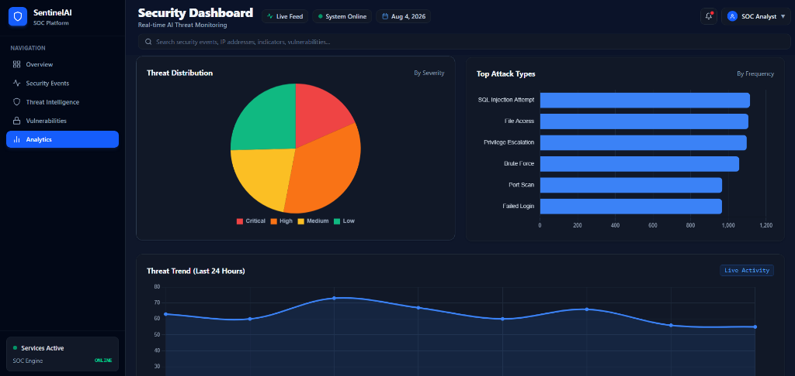
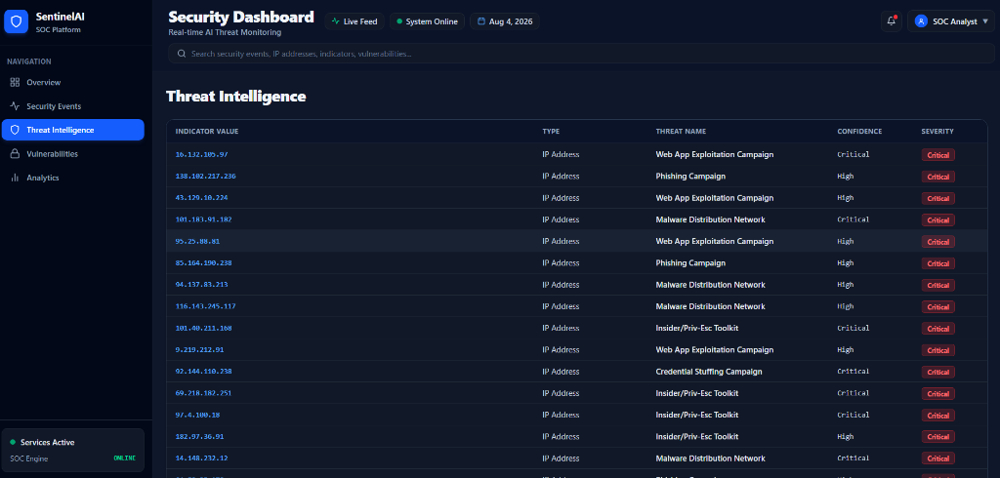

# SentinelAI Security — Dashboard UI

A modern, enterprise-grade React frontend for the SentinelAI AI-Assisted Threat Detection Dashboard (Milestones 1 & 2). Designed with high-density SOC visual layouts inspired by platforms like CrowdStrike Falcon, Splunk, and Microsoft Sentinel. Includes full Light and Dark mode theme support.

---

## Screenshots

### Executive Dashboard Overview


### AI Threat Detection (Milestone 2)


### Threat Intelligence & IOC Tracker


---

## Tech Stack

- **Framework:** React 19, Vite
- **Styling:** Tailwind CSS (Vanilla CSS design system tokens)
- **Charts:** Chart.js, React-ChartJS-2
- **Icons:** Lucide React
- **Routing:** React Router DOM
- **HTTP Client:** Native Fetch API with custom error handling & loading states

---

## Folder Structure

```
FRONTEND/
├── public/          # Static assets & screenshots
├── src/
│   ├── assets/      # Image assets & icons
│   ├── charts/      # Visualization components (AnomalyChart, ThreatTrendChart, etc.)
│   ├── components/  # Reusable UI cards, tables, panels (AiInsightPanel, ThreatTable, KpiCard)
│   ├── context/     # Global state providers (ThemeContext for Light/Dark mode)
│   ├── hooks/       # Custom React hooks (useAsyncData)
│   ├── layouts/     # Dashboard container layouts (DashboardLayout)
│   ├── pages/       # Application views (Overview, ThreatDetection, EventDetails, etc.)
│   └── services/    # Centralized REST API service layer (api.js)
├── package.json
└── vite.config.js
```

---

## Installation & Setup

Install dependencies and launch the Vite development server:

```bash
# Install dependencies
npm install

# Run development server
npm run dev

# Build production bundle
npm run build
```

Development server URL: **http://localhost:5173**

---

# Milestone 1 — Security Operations Views

- **Overview Page:** Executive security summary featuring 5 M1 KPI cards, raw threat distribution, top attack types, and event tables.
- **Security Events:** Interactive 10,000 security telemetry events table with severity filtering, search, and CSV export.
- **Threat Intelligence:** Indicator of Compromise (IOC) tracker grouped by threat confidence and attack category.
- **Vulnerabilities:** System CVE tracker displaying CVSS scores, affected assets, and patch statuses.
- **Analytics:** Multi-chart security view showing historical event frequency and severity breakdowns.

---

# Milestone 2 — AI Threat Detection & Anomaly Dashboard

The Milestone 2 dashboard (`/dashboard/detection`) provides real-time visibility into machine learning anomaly scores, soft threat classifications, and explainable hybrid threat index breakdowns.

## Data Flow Architecture & Decoupled State

```
                      FastAPI Backend (http://localhost:8000)
                                        │
                                        ▼
                            React API Service (api.js)
                                        │
             ┌──────────────────────────┼──────────────────────────┐
             ▼                          ▼                          ▼
   getModelPerformance()       getPredictionTrend()       getPredictions(page=1)
             │                          │                          │
             ▼                          ▼                          ▼
        AnomalyChart             ThreatTrendChart              ThreatTable
 (Normal/Suspicious/Critical)  (7 Historical Daily Buckets)   (Paginated 10 Rows/Page)
```

> [!IMPORTANT]
> **Decoupled Data Architecture**: All dashboard charts derive statistics from dedicated global backend endpoints (`/model-performance`, `/prediction-trend`, `/threat-summary`). Changing pagination or filters in the **Threat Predictions Table** updates only table rows, ensuring global analytics charts remain accurate and stable.

---

## Key M2 Dashboard Components

1. **KPI Summary Cards (5 Cards):** Displays Total Predictions, Critical Threats, Isolation Forest Anomalies (anomaly_label count), High-Risk Events (Suspicious + Critical verdicts), and Normal Events — all dynamically derived from `/model-performance` backend statistics.
2. **Hybrid Threat Distribution Chart (`AnomalyChart.jsx`):** Renders global verdict distribution (Normal / Suspicious / Critical) derived from the complete 10,000-prediction population via `/model-performance`. Chart is independent of table pagination.
3. **AI Prediction Volume Chart (`ThreatTrendChart.jsx`):** Renders daily historical event volume across source telemetry date range (`2025-08-01` to `2025-08-07`) aggregated from the complete dataset via `/prediction-trend`. Chart is independent of table pagination.
4. **Predicted Threat Distribution (`ThreatTypeChart.jsx`):** Horizontal bar chart illustrating predicted threat categories with hover confidence tooltips, sourced from `/threat-summary`.
5. **AI Threat Detection Summary (`AiInsightPanel.jsx`):** Dynamic narrative panel computing total evaluated predictions, Isolation Forest anomalies, critical predictions, top predicted threat categories, and top backend-calculated percentages — all dynamically generated from backend data.
6. **Top Risk Predictions (`Overview.jsx`):** Displays top 3 predictions globally ranked by `confidence_score` DESC via `GET /top-predictions?limit=3`.
7. **Threat Predictions Table (`ThreatTable.jsx`):** Paginated table with search, verdict filtering, stable container height, non-collapsing loading overlay, clickable event detail links, and CSV export (`Showing 10 of 10,000 predictions`).
8. **Explainable AI Investigation Page (`EventDetails.jsx`):** Detailed drill-down view showing real source event telemetry (Section A) and model signals breakdown — IF anomaly score, RF probabilities, triggered security rules, and plain-English reasons (Section B). Missing fields display `N/A`.

---

## Light & Dark Theme Support

- **Default Theme:** Dark mode (`#0B1329` / `#111827` background palette).
- **Theme Toggle:** Sun/Moon icon toggle located in top header area.
- **Persistence:** Selected theme persists across page refreshes via `localStorage`.
- **Adaptive Visuals:** Chart text, gridlines, tooltips, cards, and navigation adjust dynamically to light mode (`html.light`).
- **Responsive Layout:** Includes mobile drawer menu, collapsible sidebar, and scrollable data tables for 390x844 and 375x667 viewports.

---
