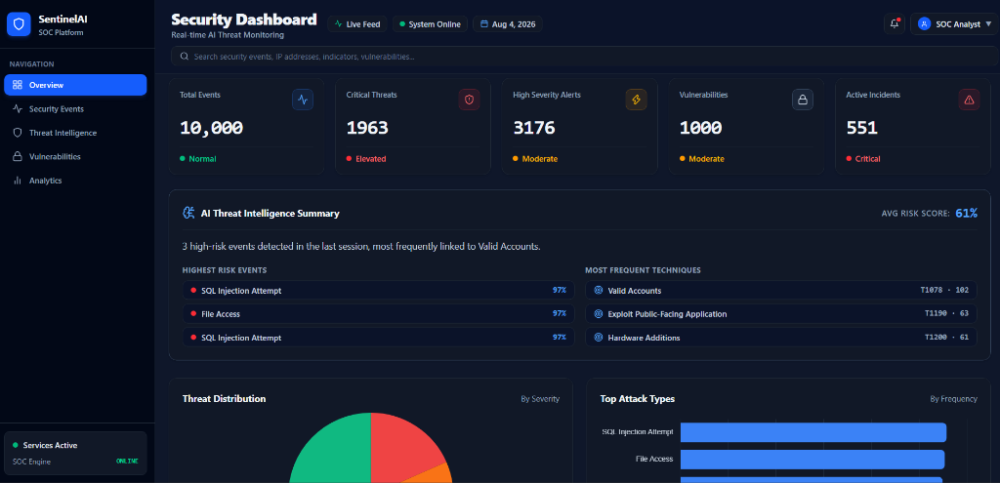
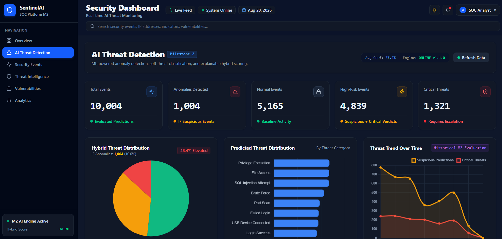

# SentinelAI Security — Dashboard UI

A modern, enterprise-grade React frontend for the SentinelAI AI-Assisted Threat Detection Dashboard (Milestones 1 & 2). Designed with high-density SOC visual layouts inspired by platforms like CrowdStrike Falcon, Splunk, and Microsoft Sentinel. Includes full Light and Dark mode theme support.

---

## Screenshots

### Executive Dashboard Overview


### AI Threat Detection (Milestone 2)


### Threat Intelligence & IOC Tracker


---

## Tech Stack

- **Framework:** React 19, Vite
- **Styling:** Tailwind CSS (Vanilla CSS design system tokens)
- **Charts:** Chart.js, React-ChartJS-2
- **Icons:** Lucide React
- **Routing:** React Router DOM
- **HTTP Client:** Native Fetch API with custom error handling & loading states

---

## Folder Structure

```
FRONTEND/
├── public/          # Static assets & screenshots
├── src/
│   ├── assets/      # Image assets & icons
│   ├── charts/      # Visualization components (AnomalyChart, ThreatTrendChart, etc.)
│   ├── components/  # Reusable UI cards, tables, panels (AiInsightPanel, ThreatTable, KpiCard)
│   ├── context/     # Global state providers (ThemeContext for Light/Dark mode)
│   ├── hooks/       # Custom React hooks (useAsyncData)
│   ├── layouts/     # Dashboard container layouts (DashboardLayout)
│   ├── pages/       # Application views (Overview, ThreatDetection, EventDetails, etc.)
│   └── services/    # Centralized REST API service layer (api.js)
├── package.json
└── vite.config.js
```

---

## Installation & Setup

Install dependencies and launch the Vite development server:

```bash
# Install dependencies
npm install

# Run development server
npm run dev

# Build production bundle
npm run build
```

Development server URL: **http://localhost:5173**

---

# Milestone 1 — Security Operations Views

- **Overview Page:** Executive security summary featuring 5 M1 KPI cards, raw threat distribution, top attack types, and event tables.
- **Security Events:** Interactive 10,000 security telemetry events table with severity filtering, search, and CSV export.
- **Threat Intelligence:** Indicator of Compromise (IOC) tracker grouped by threat confidence and attack category.
- **Vulnerabilities:** System CVE tracker displaying CVSS scores, affected assets, and patch statuses.
- **Analytics:** Multi-chart security view showing historical event frequency and severity breakdowns.

---

# Milestone 2 — AI Threat Detection & Anomaly Dashboard

The Milestone 2 dashboard (`/dashboard/detection`) provides real-time visibility into machine learning anomaly scores, soft threat classifications, and explainable hybrid threat index breakdowns.

## Data Flow Architecture & Decoupled State

```
                      FastAPI Backend (http://localhost:8000)
                                        │
                                        ▼
                            React API Service (api.js)
                                        │
             ┌──────────────────────────┼──────────────────────────┐
             ▼                          ▼                          ▼
   getModelPerformance()       getPredictionTrend()       getPredictions(page=1)
             │                          │                          │
             ▼                          ▼                          ▼
        AnomalyChart             ThreatTrendChart              ThreatTable
 (Normal/Suspicious/Critical)  (7 Historical Daily Buckets)   (Paginated 10 Rows/Page)
```

> [!IMPORTANT]
> **Decoupled Data Architecture**: All dashboard charts derive statistics from dedicated global backend endpoints (`/model-performance`, `/prediction-trend`, `/threat-summary`). Changing pagination or filters in the **Threat Predictions Table** updates only table rows, ensuring global analytics charts remain accurate and stable.

---

## Key M2 Dashboard Components

1. **KPI Summary Cards (5 Cards):** Displays Total Predictions, Critical Threats, Isolation Forest Anomalies (anomaly_label count), High-Risk Events (Suspicious + Critical verdicts), and Normal Events — all dynamically derived from `/model-performance` backend statistics.
2. **Hybrid Threat Distribution Chart (`AnomalyChart.jsx`):** Renders global verdict distribution (Normal / Suspicious / Critical) derived from the complete 10,000-prediction population via `/model-performance`. Chart is independent of table pagination.
3. **AI Prediction Volume Chart (`ThreatTrendChart.jsx`):** Renders daily historical event volume across source telemetry date range (`2025-08-01` to `2025-08-07`) aggregated from the complete dataset via `/prediction-trend`. Chart is independent of table pagination.
4. **Predicted Threat Distribution (`ThreatTypeChart.jsx`):** Horizontal bar chart illustrating predicted threat categories with hover confidence tooltips, sourced from `/threat-summary`.
5. **AI Threat Detection Summary (`AiInsightPanel.jsx`):** Dynamic narrative panel computing total evaluated predictions, Isolation Forest anomalies, critical predictions, top predicted threat categories, and top backend-calculated percentages — all dynamically generated from backend data.
6. **Top Risk Predictions (`Overview.jsx`):** Displays top 3 predictions globally ranked by `confidence_score` DESC via `GET /top-predictions?limit=3`.
7. **Threat Predictions Table (`ThreatTable.jsx`):** Paginated table with search, verdict filtering, stable container height, non-collapsing loading overlay, clickable event detail links, and CSV export (`Showing 10 of 10,000 predictions`).
8. **Explainable AI Investigation Page (`EventDetails.jsx`):** Detailed drill-down view showing real source event telemetry (Section A) and model signals breakdown — IF anomaly score, RF probabilities, triggered security rules, and plain-English reasons (Section B). Missing fields display `N/A`.

---

## Light & Dark Theme Support

- **Default Theme:** Dark mode (`#0B1329` / `#111827` background palette).
- **Theme Toggle:** Sun/Moon icon toggle located in top header area.
- **Persistence:** Selected theme persists across page refreshes via `localStorage`.
- **Adaptive Visuals:** Chart text, gridlines, tooltips, cards, and navigation adjust dynamically to light mode (`html.light`).
- **Responsive Layout:** Includes mobile drawer menu, collapsible sidebar, and scrollable data tables for 390x844 and 375x667 viewports.

---

# Milestone 3 — Risk Prioritization & Security Intelligence UI

Milestone 3 equips SOC analysts with enterprise-grade prioritization views, interactive attack chain visualizers, explainable risk breakdowns, dynamic configuration modals, and closed-loop feedback workflows.

## M3 Dedicated Screens

### 1. Risk Overview Dashboard (`/dashboard/risk` — `RiskOverview.jsx`)
- **8 Executive KPI Cards:** Total Incidents, Critical, High, Moderate, Medium, Low, Open Incidents, and False Positive count.
- **Risk Level Distribution Chart:** Doughnut chart illustrating the population breakdown across all 5 risk severity levels.
- **Incident Volume & Average Risk Score Trend:** Historical multi-axis chart showing daily incident volume and average risk score progression.
- **Priority Incidents Spotlight:** Immediate high-risk spotlight table surfacing incidents requiring immediate triage.
- **Dynamic Risk Weights Action Button:** Opens the `RiskWeightConfigModal` directly from the header to inspect or tune scoring weights at runtime.

### 2. Priority Incidents Queue (`/dashboard/incidents` — `PriorityIncidents.jsx`)
- **High-Density SOC Incident Queue:** Displays prioritized incident records sorted globally by `risk_score` descending.
- **7 Server-Side Filter Facets:**
  1. *Risk Level:* Critical, High, Moderate, Medium, Low
  2. *Threat Type:* Brute Force, Malware Detection, SQL Injection, Privilege Escalation, etc.
  3. *Asset Name:* Searchable filter across monitored enterprise endpoints and databases.
  4. *Department:* IT, Finance, Engineering, Human Resources, Operations.
  5. *MITRE Technique:* Direct technique filtering (e.g. `T1110`, `T1068`, `T1190`).
  6. *Date Range:* Start date and End date temporal filtering.
  7. *Lifecycle Status:* Open, Investigating, Resolved, False Positive.
- **Visual Badges:** Color-coded risk badges (`RiskLevelBadge`, `PriorityBadge`, `StatusBadge`).
- **Quick Status Actions & CSV Export:** Direct status updates and full queue export for offline auditing.

### 3. Comprehensive Incident Investigation (`/dashboard/incidents/:id` — `IncidentDetails.jsx`)
Deep drill-down investigation view incorporating 8 dedicated intelligence modules:
1. **Interactive Status Controller:** Dropdown enabling direct lifecycle transitions (`Open` $\to$ `Investigating` $\to$ `Resolved` $\to$ `False Positive`) with instant visual feedback and audit tracking.
2. **Explainable Risk Factor Breakdown (`RiskBreakdownCard.jsx`):** Visual progress bars showing exact decimal contributions, configured weights, normalized factor values, and contextual diagnostic reasons for all 5 factors (Threat Severity, ML Confidence, Asset Criticality, Vulnerability CVSS, Threat Intelligence).
3. **Risk Score Comparison (`RiskScoreComparisonCard.jsx`):** Before vs After correlation comparison ($\Delta = 0$), visually explaining how correlation provides contextual and adversarial visibility without artificial score inflation.
4. **Integrated Security Intelligence (`SecurityIntelligenceCard.jsx`):** 4-column contextual panel:
   - *Target Asset Context:* Hostname, Asset ID, Department, Target User.
   - *Vulnerability Context:* CVSS Score, CVE identifier, Severity Rating.
   - *Threat Intelligence:* Real campaign name, threat actor, IOC value, matched field (Source IP / Destination IP), confidence, severity, and dedicated "No Threat Intelligence Match" clean state.
   - *MITRE & ML Signals:* Model confidence, Isolation Forest anomaly score, and MITRE ATT&CK technique chips.
5. **Animated Attack Chain Timeline (`AttackChainTimeline.jsx`):** Sequential adversary progression with playback animation, speed toggle, tactic indicators, and timestamp progression.
6. **Advisory SOC Response Recommendations (`RecommendationsPanel.jsx`):** Tailored non-destructive containment and remediation actions grouped by threat category and chain structure.
7. **Analyst False Positive Review Card (`AnalystFeedbackCard.jsx`):** Structured audit cards displaying historical False Positive justifications, analyst signatures, and investigation comments.
8. **Incident Lifecycle Audit Trail:** Chronological timeline tracking every status change, timestamp, initiating user/system, and associated reason.
9. **Correlated Security Events Timeline:** List of all security events associated within the 15-minute sliding correlation window.

### 4. Attack Chains Explorer (`/dashboard/attack-chains` — `AttackChains.jsx`)
- Complete organizational feed of multi-stage attack chains detected across telemetry.
- Filterable by attack chain type (`Brute Force Chain`, `Privilege Escalation Chain`, `Data Exfiltration Chain`), confidence rating, and affected asset.

---

## M3 Interactive & Advanced Features

### Dynamic Risk Weights Modal (`RiskWeightConfigModal.jsx`)
- Accessible via the "Configure Risk Weights" button on the Risk Overview page.
- 5 interactive percentage sliders for `threat_severity`, `ml_confidence`, `asset_criticality`, `vulnerability_cvss`, and `threat_intelligence`.
- **Zero-Value Safe Handling:** Uses nullish coalescing (`??`) to ensure factors set to 0% remain 0% when saved, fetched, and reopened without defaulting back to 25%.
- **Live Normalization Validator:** Dynamic counter enforcing that the sum of all 5 weights must equal exactly 100%. The "Save Active Weights" button is automatically disabled if total $\ne 100\%$.
- **Reset Defaults Button:** Restores factory weights `(25%, 25%, 20%, 20%, 10%)` with a single click.

### Animated Attack Chain Replay Controller
- Built into `AttackChainTimeline.jsx` with full playback controls:
  - **Play / Pause:** Auto-advances through attack stages with animated highlighting.
  - **Speed Selector:** Toggle between `0.5x`, `1.0x`, and `2.0x` replay speeds.
  - **Step Scrubbing:** Step Forward and Step Backward buttons for granular stage-by-stage analysis.
  - **Stage Markers:** Pulsing status indicators showing active stage, completed stages, and upcoming progression.

### Analyst Feedback Modal (`AnalystFeedbackModal.jsx`)
- Triggered via the "Mark as False Positive" button on any incident.
- Requires selecting a structured reason from the validated SOC taxonomy:
  - *Benign administrative activity*
  - *Expected user behavior*
  - *Security scanner / automated tool*
  - *Incorrect threat classification*
  - *Incorrect enrichment*
  - *Excessive sensitivity*
  - *Other*
- Optional analyst notes textarea and analyst name signature.
- On submission, automatically transitions the incident to `False Positive`, logs the feedback record in MongoDB, appends an entry to `status_history`, and refreshes the investigation view.

