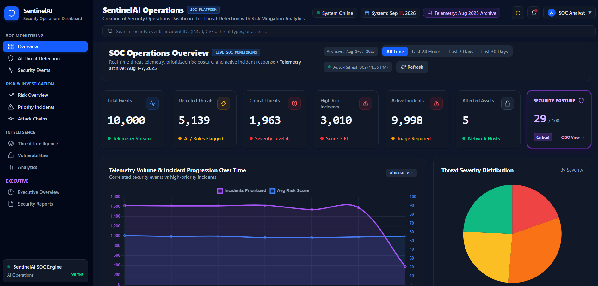
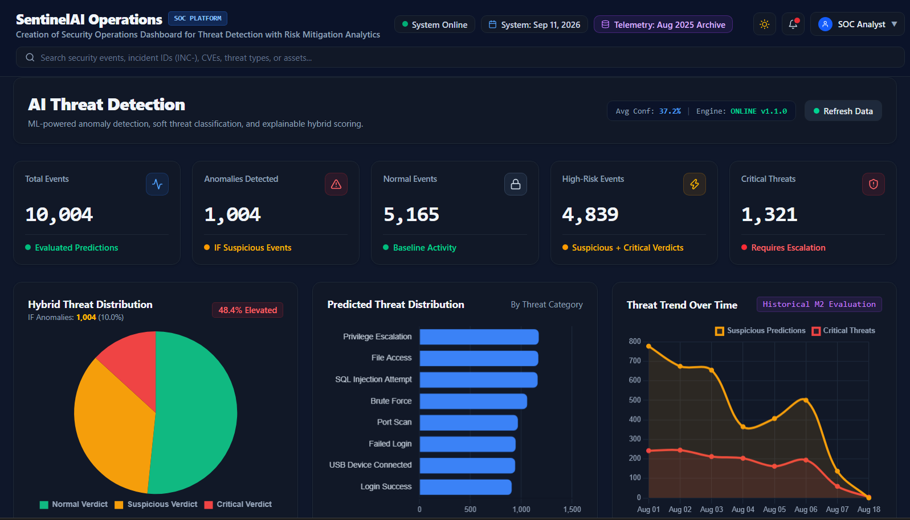
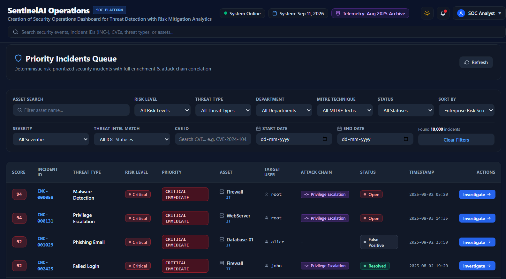

# SentinelAI -- Creation of Security Operations Dashboard for Threat Detection with Risk Mitigation Analytics

**Official Project Title:** Creation of Security Operations Dashboard for Threat Detection with Risk Mitigation Analytics  
**Product Brand:** SentinelAI  

SentinelAI is a modern AI-assisted cybersecurity operations platform built with React 19, Tailwind CSS, and Chart.js. Inspired by modern SOC platforms like CrowdStrike Falcon, Splunk ES, and Microsoft Sentinel, it integrates multi-source telemetry ingestion, machine learning anomaly detection, deterministic 5-factor risk scoring, multi-stage attack correlation, threat intelligence enrichment, executive posture metrics, and compliance reporting into one unified experience.

---

## Screenshots

### SOC Operations Dashboard Overview


### AI Threat Detection (Milestone 2)


### Priority Incidents Queue


---


## Architecture Overview

SentinelAI unites Milestones 1 through 4 into a continuous end-to-end security workflow:

```
Telemetry Ingestion (M1) --> ML Anomaly Detection (M2) --> 5-Factor Risk & Attack Correlation (M3)
                                                                           |
                                                                           v
Executive Posture & Reports (M4) <-- Unified SOC Dashboard (M4) <-- Incident Queue & Investigation (M3)
```


## Milestone Evolution

### Milestone 1 — Security Data Foundation
Established the core security dashboard, telemetry views, threat intelligence,
vulnerability tracking, analytics, and backend API integration.

### Milestone 2 — AI Threat Detection
Introduced Isolation Forest anomaly detection, Random Forest classification,
hybrid threat scoring, confidence visualization, and explainable AI investigation.

### Milestone 3 — Risk Prioritization & Security Intelligence
Added deterministic 5-factor risk scoring, incident prioritization,
attack-chain correlation, explainable risk breakdowns, recommendations,
and analyst feedback workflows.

### Milestone 4 — Unified Security Operations
Integrated the previous capabilities into the final SOC platform with
security posture, executive visibility, cross-domain intelligence,
investigation drill-down, and security reporting.

### Complete User Journey
1. **Login & Authentication**: Analyst-facing entry point for accessing the SentinelAI SOC dashboard..
2. **SOC Overview (`/dashboard`)**: High-level operational awareness, 7 dynamic KPIs, real-time telemetry trends, threat distributions, and critical incident alerts.
3. **AI Threat Detection (`/dashboard/detection`)**: Machine learning anomaly classification (Isolation Forest + Random Forest), probability distribution, and confidence scores.
4. **Security Telemetry (`/dashboard/events`)**: High-volume telemetry feed with severity filtering and search.
5. **Risk Overview (`/dashboard/risk-overview`)**: Holistic risk engine posture, weight configuration modal, and volume-vs-score trends.
6. **Priority Incidents Queue (`/dashboard/incidents`)**: Multi-faceted server-side filtering with URL parameter synchronization.
7. **Incident Investigation (`/dashboard/incidents/:id`)**: Deep-dive triage with "Why Is This Incident Risky?" explainability, IP/CVE intelligence, attack chain progression, and quick lifecycle actions.
8. **Attack Chains (`/dashboard/attack-chains`)**: Multi-stage attack progression with animated sequential playback and replay controls.
9. **Threat Intelligence (`/dashboard/threat-intel`)**: Known indicator tracking (IPs, hashes, domains) with active incident cross-references.
10. **Vulnerabilities (`/dashboard/vulnerabilities`)**: Enterprise CVE tracking, CVSS severity ratings, patch status, and asset impact.
11. **Executive Security Posture (`/dashboard/executive`)**: Deterministic 0-100 security health gauge with 5-factor penalty breakdown, KPI cards, and strategic remediation recommendations.
12. **Security Reporting (`/dashboard/reports`)**: Executive summaries, attack chain audit, and one-click RFC 4180 streaming CSV & JSON exports.

---

## 4-Tier Navigation Structure

The navigation hierarchy is organized into four intuitive SOC operational tiers:

```
|-- SOC MONITORING
|   |-- SOC Overview           /dashboard
|   |-- Threat Detection       /dashboard/detection
|   `-- Security Events        /dashboard/events
|
|-- RISK & INVESTIGATION
|   |-- Risk Engine            /dashboard/risk-overview
|   |-- Priority Incidents     /dashboard/incidents
|   `-- Attack Chains          /dashboard/attack-chains
|
|-- INTELLIGENCE
|   |-- Threat Intelligence    /dashboard/threat-intel
|   |-- Vulnerabilities        /dashboard/vulnerabilities
|   `-- Analytics              /dashboard/analytics
|
`-- EXECUTIVE & AUDIT
    |-- Executive Posture      /dashboard/executive
    `-- Security Reports       /dashboard/reports
```

---

## Key Platform Features

### 1. Primary SOC Overview (`/dashboard`)
- **7 Live KPI Cards**: Total Ingested Events, Detected Threats, Critical Incidents, High Incidents, Active Incidents (Open + Investigating), Monitored Assets, and System Security Posture Score.
- **Time-Range Selector**: Filter telemetry trends across `24h`, `7d`, `30d`, or `all`.
- **Silent 30s Polling**: Automatic background polling keeps metrics up-to-date with a pulse indicator and manual refresh control.
- **Interactive Visualizations**:
  - *Telemetry Volume & Incident Progression Trend*: Historical line chart comparing total events against incident volume.
  - *Threat Severity Distribution*: Pie chart of incident severity breakdown.
  - *Threat Type Breakdown*: Clickable bar chart that drills down directly into `/dashboard/incidents?threat_type=...`.
  - *Incident Lifecycle Status*: Doughnut chart displaying Open, Investigating, Resolved, and False Positive states.
- **Critical Incidents Spotlight**: Direct table surfacing high-priority incidents with one-click navigation to investigation details.

### 2. Executive Security Posture (`/dashboard/executive`)
- **Deterministic 0-100 Security Posture Gauge**: Server-side posture score based on critical incident density, vulnerability exposure, asset risk exposure, anomaly rate, and active threat-intelligence matches.
- **5-Factor Penalty Deduction Breakdown**: Visual progress bars showing exactly where posture deductions originate.
- **6 Executive KPIs**: Posture Score, Total Incidents, Active Threats, Critical CVEs, Active IOCs, and Mean Time to Triage (MTTT).
- **Incident Progression vs Ingested Telemetry**: Dual-axis trend line analyzing attack velocity against telemetry volume.
- **Top Impacted Assets**: Breakdown of compromised hosts by incident density and asset criticality.
- **Strategic Remediation Roadmap**: Actionable executive recommendations prioritized by risk reduction impact.

### 3. Compliance & Security Reporting (`/dashboard/reports`)
- **One-Click Streaming CSV Export**: Direct link to `/api/v1/reports/security.csv` generating RFC 4180 compliant CSV exports with proper escaping and streaming headers.
- **Comprehensive JSON Export**: Client-side trigger for downloading `/api/v1/reports/security.json` formatted for SIEM/SOAR ingestion.
- **Report Preview Summary**: In-browser report review with dynamic metric cards, active MITRE techniques, CVE exposures, and prioritized response checklists.

### 4. Advanced Incident Filtering & Deep Drill-Down (`/dashboard/incidents`)
- **URL Parameter Binding**: Search parameters (`useSearchParams`) dynamically bind to browser URLs, enabling shareable incident queries.
- **Comprehensive Server-Side Facets**: Filter by Risk Level, Priority, Threat Type, Target Asset, Department, MITRE Technique, Severity, IOC Status, CVE Identifier, and Date Range.
- **Clickable Telemetry Cross-References**: Correlated event badges and attack chain stages contain clickable links pointing directly to `/dashboard/events/:id`.
- **"Why Is This Incident Risky?" Card**: Plain-English, deterministic explanation synthesizing the 5 risk factors directly from backend scoring reasons.
- **Quick Action Workflow**: Instant status progression buttons (`Mark Investigating`, `Mark Resolved`, `Mark False Positive`) with structured analyst feedback capture.

### 5. Threat Intelligence & Vulnerability Trackers
- **Threat Intelligence (`/dashboard/threat-intel`)**: Dedicated dashboard for indicators of compromise (IPs, domains, hashes) with indicator type filtering, threat severity, actor attribution, confidence ratings, and cross-links to matched incidents.
- **Vulnerabilities (`/dashboard/vulnerabilities`)**: Enterprise vulnerability catalog displaying CVSS v3 scores, patch availability badges, affected endpoints, and direct links to correlated security incidents.

---

## Tech Stack

- **Framework**: React 19, Vite
- **Styling**: Tailwind CSS with custom CSS design tokens
- **Charting**: Chart.js 4, React-ChartJS-2
- **Icons**: React Icons (Feather Icons `react-icons/fi`)
- **Routing**: React Router DOM v6
- **HTTP Client**: Native Fetch API with centralized error handling and query string serialization

---

## Installation & Setup

### Prerequisites
- Node.js 18+ and npm
- Running SentinelAI Backend on `http://localhost:8000`

### Quick Start

```bash
# Navigate to FRONTEND directory
cd FRONTEND

# Install dependencies
npm install

# Run Vite development server
npm run dev

# Run ESLint validation
npm run lint

# Compile production build
npm run build
```

The development server will run at: **http://localhost:5173**

---

## Verification & Quality Assurance

- **Zero Hardcoded Data**: All dashboard cards, charts, and metrics are dynamically fetched from the FastAPI backend.
- **Zero Calculation Duplication**: All risk scores, security postures, and percentage distributions are calculated deterministically by backend services.
- **Theme Consistency**: Full dark and light mode theme support maintained across all new M4 executive and reporting screens.
- **Lint & Build Clean**: Clean ESLint run (0 errors) and successful Vite production compilation.

